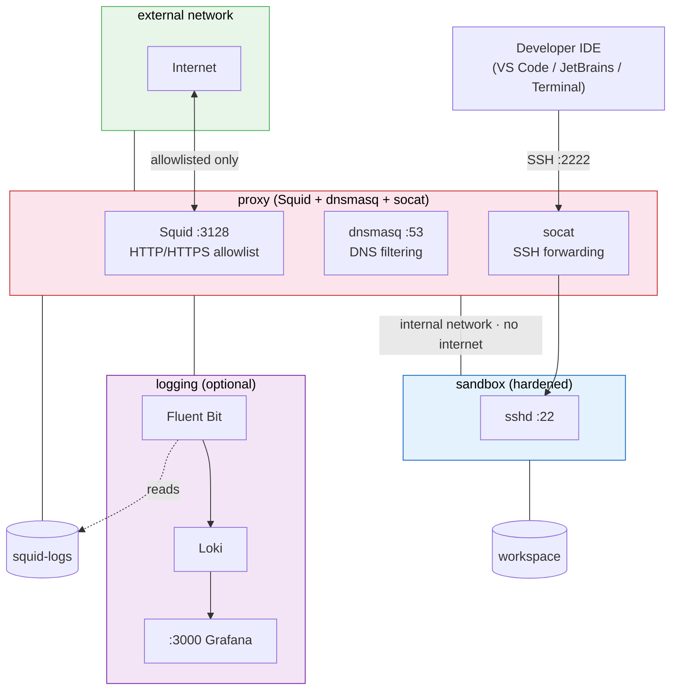
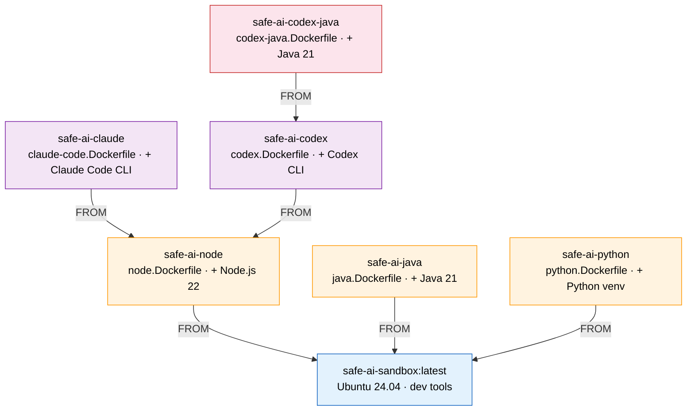

# safe-ai

Sandboxed containers for AI coding agents. Network isolation, domain allowlisting, and syscall filtering via Docker Compose.

**Stack:** [Docker Compose](https://docs.docker.com/compose/) · [Squid](http://www.squid-cache.org/) · [dnsmasq](https://dnsmasq.org/) · [seccomp](https://docs.docker.com/engine/security/seccomp/) · [socat](http://www.dest-unreach.org/socat/)

| Component | Role |
|-----------|------|
| Docker Compose | Orchestrates all containers, networks, and volumes in a single declarative file |
| Squid | Forward proxy that enforces the domain allowlist on HTTP/HTTPS traffic |
| dnsmasq | Lightweight DNS server that blocks resolution for non-allowlisted domains |
| seccomp | Linux kernel feature that filters dangerous syscalls (ptrace, mount, bpf, etc.) |
| socat | Forwards SSH connections from the host through the proxy into the sandbox |



## How It Works

The sandbox container sits on a Docker network marked `internal: true` — it has **no route to the internet**. All outbound traffic goes through the proxy container, which is the only container on both the internal and external networks.

The proxy runs two gatekeepers: **dnsmasq** blocks DNS resolution for any domain not in your allowlist, and **Squid** enforces the same allowlist on HTTP/HTTPS connections. Together they ensure only explicitly approved domains are reachable.

The sandbox itself is hardened: read-only root filesystem, all Linux capabilities dropped, a seccomp profile filtering dangerous syscalls (ptrace, mount, bpf, kexec), and noexec on /tmp. SSH access is forwarded through the proxy via socat. Even if an AI agent tries to bypass the proxy, there is no network route out.

## Security Requirements

safe-ai implements a [12-requirement security framework](docs/security-requirements.md) for enterprises deploying AI coding agents, synthesized from OWASP, NIST, MITRE, and ISO standards.

| # | Requirement | Priority | Description |
|---|-------------|----------|-------------|
| R1 | Network Egress Control | **Mandatory** | Deny-all egress with domain-level allowlisting |
| R2 | Sandbox Isolation | **Mandatory** | Container hardening, seccomp, dropped capabilities |
| R3 | Credential Separation | **Mandatory** | API tokens injected at proxy layer, never in sandbox |
| R4 | Human Approval Gates | **Mandatory** | Destructive/external actions require confirmation |
| R5 | Audit Logging | **Mandatory** | Structured logging of all allowed and denied requests |
| R6 | Filesystem Scoping | **Mandatory** | Agent restricted to workspace directory only |
| R7 | Resource Limits | **Mandatory** | Memory, CPU, and PID limits enforced |
| R8 | Supply Chain Controls | Recommended | Registry restrictions, lock files, MCP validation |
| R9 | Code Review Enforcement | Recommended | PR workflows, SAST scanning, security file flagging |
| R10 | Data Classification | Recommended | Policy for what data AI agents can process |
| R11 | Agent Identity | Recommended | Attribution of agent actions to developers |
| R12 | Incident Response | Recommended | Kill switch, forensics, response procedures |

See [Security Requirements](docs/security-requirements.md) for full details, enterprise scenarios, and framework mappings.

## Quickstart

```bash
# 1. Clone
git clone https://github.com/safe-ai-project/safe-ai.git
cd safe-ai

# 2. Edit your allowlist (optional — sensible defaults included)
vim allowlist.yaml

# 3. Build and start
docker compose up -d --build

# 4. Connect via SSH (VS Code Remote-SSH, JetBrains Gateway, or terminal)
ssh -p 2222 dev@localhost

# 5. Verify isolation
curl https://api.anthropic.com    # works (allowlisted)
curl https://evil.com             # blocked (403)
ping 8.8.8.8                     # blocked (no route)
```

## Configuration

Copy the example files and customize:

```bash
cp .env.example .env                                          # infrastructure config
cp docker-compose.override.yaml.example docker-compose.override.yaml  # API keys & mounts
```

Edit `.env` for SSH port, key path, and resource limits. Edit `docker-compose.override.yaml` to pass API keys and mount local code. Neither file is committed to git.

Or run `./scripts/setup.sh` to do this automatically.

## Allowlist Configuration

Edit `allowlist.yaml` to control which domains the sandbox can reach:

```yaml
domains:
  - api.anthropic.com
  - api.openai.com
  - github.com
  - registry.npmjs.org
```

Three ways to configure:

| Method | How | Use case |
|--------|-----|----------|
| **File** | Edit `allowlist.yaml` | Default for most teams |
| **ENV** | `SAFE_AI_DEFAULT_DOMAINS=a.com,b.com` | CI/CD additions |
| **Mount** | `SAFE_AI_ALLOWLIST=./my-list.yaml docker compose up` | Per-project override |

Domains from all sources are merged. Subdomains are automatically included (e.g. `github.com` also allows `api.github.com`).

## Security Model

**What is prevented:**

- Outbound connections to non-allowlisted domains (proxy + network isolation)
- System file modification (read-only root filesystem)
- Privilege escalation (all capabilities dropped, no-new-privileges)
- Raw sockets / ICMP covert channels (no CAP_NET_RAW)
- Dangerous syscalls — ptrace, mount, bpf, unshare, kexec (seccomp filter)
- Execution from /tmp (noexec mount)
- Proxy bypass (sandbox has no route to internet, only to proxy on internal network)

**Accepted risks (documented):**

- Exfiltration via allowlisted domains (scope your allowlist narrowly)
- Container escape via kernel zero-day (add gVisor for defense-in-depth — see below)
- Workspace volume has no size limit (Docker/ext4 limitation — monitor with `du -s /workspace`)
- Interpreted scripts bypass noexec (`bash /tmp/script.sh` works; noexec only blocks ELF binaries)
- Rate limiting belongs at the enterprise gateway, not the proxy
- memfd_create enables fileless execution (allowed for dev tool compatibility)

See [Responsibility Boundary](docs/responsibility-boundary.md) for what safe-ai controls vs. what organizations must handle.

**Monitoring proxy traffic:**

```bash
docker compose logs proxy                     # all proxy logs
docker compose logs proxy | grep DENIED       # blocked requests only
docker compose logs -f proxy                  # follow in real-time
```

**Audit logging:** Optional centralized logging with Fluent Bit, Loki, and Grafana records every allowed and denied request. Quick start: `docker compose --profile logging up -d`. See [Audit Logging](docs/audit-logging.md) for setup, LogQL queries, and central server configuration.

### Hardening with gVisor

[gVisor](https://gvisor.dev) adds kernel-level isolation by intercepting all syscalls before they reach the host kernel — the one risk standard Docker isolation cannot address.

```bash
sudo ./scripts/install-gvisor.sh       # install (one-time, requires sudo)
echo 'SAFE_AI_RUNTIME=runsc' >> .env   # enable
docker compose up -d --force-recreate  # restart
```

For org-wide enforcement: `sudo ./scripts/install-gvisor.sh --default` sets gVisor as the Docker daemon default.

## Extending the Base Image

safe-ai is a base — add your own tools by extending the sandbox image:

```dockerfile
# my-sandbox.Dockerfile
FROM safe-ai-sandbox:latest

USER root
RUN apt-get update && apt-get install -y openjdk-21-jdk && rm -rf /var/lib/apt/lists/*
ENV JAVA_HOME=/usr/lib/jvm/java-21-openjdk-amd64
USER dev
```

Then override in `docker-compose.override.yaml`:

```yaml
services:
  sandbox:
    build:
      context: .
      dockerfile: my-sandbox.Dockerfile
```

All security properties (read-only root, capability drops, seccomp, network isolation) are enforced by the compose file, not the Dockerfile — they are inherited automatically.

### Example Layer Graph



Build in dependency order:

```bash
docker compose build                                              # base sandbox + proxy
docker build -f examples/node.Dockerfile -t safe-ai-node .       # shared Node.js layer
docker build -f examples/claude-code.Dockerfile -t safe-ai-claude .
docker build -f examples/codex.Dockerfile -t safe-ai-codex .
docker build -f examples/java.Dockerfile -t safe-ai-java .
docker build -f examples/codex-java.Dockerfile -t safe-ai-codex-java .
docker build -f examples/python.Dockerfile -t safe-ai-python .
```

See `examples/` for full Dockerfiles and `examples/codex-config.toml` for a sample Codex runtime configuration.

## IDE Setup

**VS Code**: Install "Remote - SSH" extension, connect to `dev@localhost:2222`.

**JetBrains**: Use JetBrains Gateway, connect via SSH to `localhost:2222`.

**SSH key**: By default, `~/.ssh/id_ed25519.pub` is mounted. Override with:

```bash
SAFE_AI_SSH_KEY=~/.ssh/id_rsa.pub docker compose up -d
```

## Troubleshooting

| Problem | Cause | Fix |
|---------|-------|-----|
| SSH "connection refused" | Container not running | `docker compose ps` to check, `docker compose up -d` to start |
| SSH "host key changed" | Container rebuilt (new host keys) | `ssh-keygen -R '[localhost]:2222'` |
| `curl` returns 403 | Domain not in allowlist | Add to `allowlist.yaml` and restart: `docker compose restart proxy` |
| `apt-get` fails | Read-only root filesystem | Pre-install in a custom Dockerfile (see "Extending the Base Image") |
| Can't see my local files | Using named volume | Use `docker-compose.override.yaml` with a bind mount (see example) |
| DNS resolution fails | Proxy not healthy | `docker compose logs proxy` to check for errors |

## Scripts

| Script | Description | Example |
|--------|-------------|---------|
| `setup.sh` | First-time setup wizard — validates Docker, SSH, creates `.env`, WSL2 checks | `./scripts/setup.sh` |
| `test.sh` | Smoke tests for sandbox isolation (allowlist, read-only FS, caps, gVisor) | `./scripts/test.sh` |
| `install-gvisor.sh` | Installs gVisor runtime for kernel-level syscall isolation | `sudo ./scripts/install-gvisor.sh` |
| `publish.sh` | Build and push images to private registries with dependency resolution | `REGISTRY=reg.co ./scripts/publish.sh` |
| `aibox.sh` | Standalone startup — pulls from registry, generates compose at runtime | `REGISTRY=reg.co aibox.sh` |
| `risk-assessment.sh` | Interactive enterprise risk assessment wizard, generates configs | `./scripts/risk-assessment.sh` |

## Platform Notes

**Podman:** Works with `podman compose` (built-in). Use `podman compose`, **not** `podman-compose` (third-party). See [Podman notes](docs/podman.md).

**WSL2:** Runs inside WSL2 with Docker Desktop. Clone to the WSL2 filesystem (`~/`), not `/mnt/c/`. Run `./scripts/setup.sh` to detect and fix common issues. See [WSL2 setup](docs/wsl2.md).

**Registry publishing:** For teams distributing pre-built images via Nexus, Artifactory, or Harbor, see [Registry Distribution](docs/registry-distribution.md).

## Documentation

| Document | Audience | Description |
|----------|----------|-------------|
| [Responsibility Boundary](docs/responsibility-boundary.md) | All | What safe-ai controls vs. what organizations must handle |
| [Security Requirements](docs/security-requirements.md) | Security teams | R1-R12 security requirements framework for AI coding agents |
| [Enterprise Risk Mapping](docs/enterprise-risk-mapping.md) | Security teams | OWASP mapping, risk analysis, and acceptance checklist |
| [Enterprise Example](docs/enterprise-example.md) | Regulated industries | Worked example -- DFARS/CMMC deployment for 120 developers |
| [Supply Chain Security](docs/supply-chain.md) | Dev teams | Guidance on packages, registries, and MCP servers |
| [Audit Logging](docs/audit-logging.md) | Ops / Security | Fluent Bit + Loki + Grafana setup and LogQL queries |
| [Incident Response](docs/incident-response.md) | Ops / SRE | Runbook for containing and recovering from incidents |
| [Registry Distribution](docs/registry-distribution.md) | Platform teams | Building, pushing, and distributing images via private registries |
| [Managed Deployment](docs/managed-deployment.md) | Platform teams | Centralized deployment where developers only SSH in |
| [WSL2 Setup](docs/wsl2.md) | Windows users | Windows-specific installation and troubleshooting |
| [Podman](docs/podman.md) | Podman users | Podman-specific setup and verification |


## Environment Variables

| Variable | Default | Description |
|----------|---------|-------------|
| `SAFE_AI_SSH_PORT` | `2222` | Host port for SSH |
| `SAFE_AI_SSH_KEY` | `~/.ssh/id_ed25519.pub` | Public key to mount |
| `SAFE_AI_ALLOWLIST` | `./allowlist.yaml` | Path to allowlist file |
| `SAFE_AI_DEFAULT_DOMAINS` | (empty) | Extra domains (comma-separated) |
| `SAFE_AI_RUNTIME` | (empty) | Container runtime (`runsc` for gVisor) |
| `SAFE_AI_SANDBOX_MEMORY` | `8g` | Sandbox memory limit |
| `SAFE_AI_SANDBOX_CPUS` | `4` | Sandbox CPU limit |
| `SAFE_AI_LOKI_URL` | (empty) | Central Loki URL (omit for local). Profile: `logging` |
| `SAFE_AI_HOSTNAME` | (auto-detected) | Workstation label in audit logs. Profile: `logging` |
| `SAFE_AI_GRAFANA_PORT` | `3000` | Host port for Grafana. Profile: `logging` |
| `SAFE_AI_GRAFANA_PASSWORD` | `admin` | Grafana admin password. Profile: `logging` |
| `SAFE_AI_DNS_UPSTREAM` | `8.8.8.8` | Primary upstream DNS resolver |
| `SAFE_AI_DNS_UPSTREAM_2` | `8.8.4.4` | Secondary upstream DNS resolver |

## License

Apache 2.0
