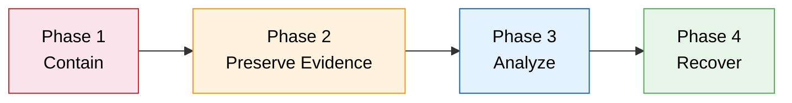

# Incident Response Runbook

Operational runbook for responding to a suspected sandbox compromise or unexpected agent behavior.

---



## Phase 1: Contain

Stop all containers immediately:

```bash
make kill
# or
docker compose --profile logging down --remove-orphans
```

Revoke any credentials that may have been exposed:
- Rotate the `SAFE_AI_GATEWAY_TOKEN` and any API keys passed via `docker-compose.override.yaml`
- Revoke SSH keys mounted into the sandbox
- If the agent had git push access, rotate deploy keys or PATs

## Phase 2: Preserve Evidence

Snapshot the workspace volume before doing anything else:

```bash
make snapshot
# or
docker run --rm -v safe-ai_workspace:/data -v "$(pwd)":/backup alpine \
  tar czf /backup/workspace-snapshot-$(date +%Y%m%d-%H%M%S).tar.gz -C /data .
```

Copy Squid access logs from the proxy container:

```bash
docker cp safe-ai-proxy:/var/log/squid/ ./incident-logs/
```

**Important:**
- Volumes survive `docker compose down` -- do NOT use the `-v` flag or you will destroy evidence.
- If the logging profile was active, Loki retains all proxy logs independently of the Squid log files.

## Phase 3: Analyze

**Review Squid access logs for anomalies:**
- Denied request spikes (probing or escape attempts)
- Unusual destination domains
- Large uploads (`request_bytes` anomalies)
- Requests to allowlisted domains at unusual times

**If Grafana/Loki was enabled**, use LogQL queries:

```logql
# All denied requests
{job="safe-ai"} | json | squid_action="TCP_DENIED"

# Large uploads (potential exfiltration)
{job="safe-ai"} | json | request_bytes > 100000

# Activity in a specific time range
{job="safe-ai"} | json | timestamp >= "07/Mar/2026:14:00"
```

**Review git history in the workspace** for unauthorized commits:

```bash
# Mount the workspace volume and inspect
docker run --rm -v safe-ai_workspace:/workspace -w /workspace alpine/git \
  git log --oneline --all
```

## Phase 4: Recover

1. **Rebuild images from scratch** (eliminates any tampering with image layers):
   ```bash
   docker compose build --no-cache
   ```

2. **Rotate all credentials:**
   - API keys (LLM provider, gateway token)
   - SSH keys (generate new keypair, update `SAFE_AI_SSH_KEY`)
   - Any git credentials the agent had access to

3. **Review and tighten the allowlist:**
   - Remove any domains that are no longer needed
   - Check if the incident involved an allowlisted domain

4. **Review git history** in any repositories the agent could push to:
   ```bash
   git log --oneline --since="2026-03-07"   # adjust to incident date
   ```

5. **Restart with fresh state:**
   ```bash
   docker compose up -d --build
   ```
