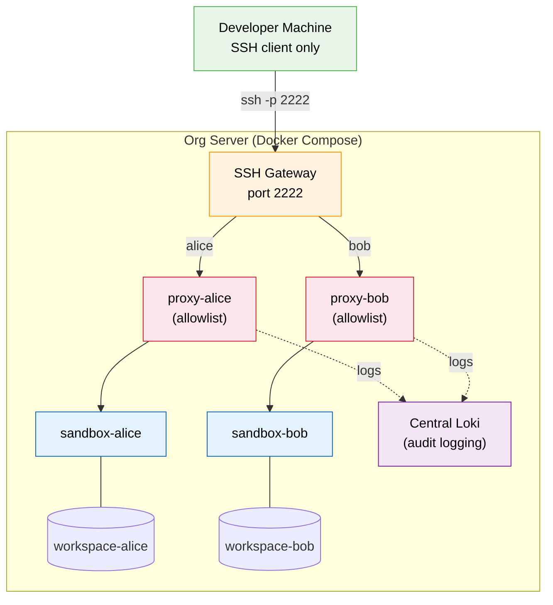

# Managed Deployment

In a managed deployment, the platform team runs safe-ai containers on a central server and developers connect via SSH. Developers do not need Docker, the `aibox` script, or the repository — just an SSH client.

## Architecture



## Self-Service vs. Managed

| Aspect | Self-Service | Managed |
|--------|-------------|---------|
| Who runs containers | Developer | Platform team |
| Docker required on dev machine | Yes | No |
| Script needed | Yes (`aibox`) | No |
| Allowlist editable by developer | Yes | No (locked by policy) |
| Audit logging | Optional | Mandatory |
| SSH key management | Dev-provided | Org-issued |
| Resource limits | Dev-configurable | Centrally enforced |

## Per-User Isolation with COMPOSE_PROJECT_NAME

Docker Compose provides built-in per-user isolation via `COMPOSE_PROJECT_NAME`. Each project name creates separate containers, volumes, and networks — no changes to `docker-compose.yaml` are needed.

```bash
# Start a sandbox for alice
COMPOSE_PROJECT_NAME=alice docker compose up -d

# Start a sandbox for bob
COMPOSE_PROJECT_NAME=bob docker compose up -d
```

This creates:
- `alice-sandbox-1` and `alice-proxy-1` containers
- `alice_workspace` and `alice_vscode-server` volumes
- `alice_internal` and `alice_external` networks

Each user is fully isolated from the others at the Docker level.

### Managing Multiple Users

```bash
# List all running sandboxes
docker ps --filter "label=com.docker.compose.service=sandbox"

# Stop a specific user's sandbox
COMPOSE_PROJECT_NAME=alice docker compose down

# View logs for a specific user
COMPOSE_PROJECT_NAME=alice docker compose logs proxy

# Update all sandboxes (pull new images, recreate)
for user in alice bob charlie; do
    COMPOSE_PROJECT_NAME=$user docker compose pull
    COMPOSE_PROJECT_NAME=$user docker compose up -d
done
```

## SSH Access Patterns

Developers need SSH access to their sandbox. There are two approaches:

### Option A: Unique Port per Developer

Assign each developer a unique SSH port:

```bash
# alice gets port 2222
COMPOSE_PROJECT_NAME=alice SAFE_AI_SSH_PORT=2222 docker compose up -d

# bob gets port 2223
COMPOSE_PROJECT_NAME=bob SAFE_AI_SSH_PORT=2223 docker compose up -d
```

Developers connect directly:

```bash
# alice
ssh -p 2222 dev@sandbox-host.corp.com

# bob
ssh -p 2223 dev@sandbox-host.corp.com
```

**Pros:** Simple, no extra infrastructure. **Cons:** Port management overhead, doesn't scale past ~50 users.

### Option B: SSH Gateway

Run an SSH bastion that routes connections by username. This uses a single port for all developers.

Example using `socat` as a simple gateway:

```bash
#!/bin/bash
# ssh-gateway.sh — route SSH by port offset
# alice=2222, bob=2223, etc.
# Developers connect: ssh -p <port> dev@gateway.corp.com

# Map of user → internal sandbox port
declare -A USERS=(
    [2222]="alice-proxy-1:2222"
    [2223]="bob-proxy-1:2222"
    [2224]="charlie-proxy-1:2222"
)

for port in "${!USERS[@]}"; do
    target="${USERS[$port]}"
    socat TCP-LISTEN:${port},fork,reuseaddr TCP:${target} &
done

wait
```

For larger deployments, use nginx stream proxy:

```nginx
# /etc/nginx/nginx.conf (stream block)
stream {
    upstream sandbox-alice {
        server alice-proxy-1:2222;
    }
    upstream sandbox-bob {
        server bob-proxy-1:2222;
    }

    server {
        listen 2222;
        proxy_pass sandbox-alice;
    }
    server {
        listen 2223;
        proxy_pass sandbox-bob;
    }
}
```

## SSH Key Management

In a managed deployment, the platform team controls SSH keys rather than letting developers mount their own.

### Option A: Platform-Managed Keys

The platform team collects SSH public keys and provisions them into each sandbox:

```bash
# Create a directory of authorized keys
mkdir -p /opt/safe-ai/ssh-keys/

# Each developer's public key
cp alice_id_ed25519.pub /opt/safe-ai/ssh-keys/alice.pub
cp bob_id_ed25519.pub /opt/safe-ai/ssh-keys/bob.pub

# Start with user-specific key
COMPOSE_PROJECT_NAME=alice \
  SAFE_AI_SSH_KEY=/opt/safe-ai/ssh-keys/alice.pub \
  docker compose up -d
```

### Option B: SSH Certificate Authority (Recommended for Scale)

For larger teams, use an SSH certificate authority. The org signs developer keys with a CA, and sandboxes trust the CA rather than individual keys.

In `sshd_config` (inside the sandbox image):

```
TrustedUserCAKeys /etc/ssh/trusted_user_ca_keys.pub
```

The platform team:
1. Generates a CA key pair
2. Signs each developer's public key with a time-limited certificate
3. Mounts the CA public key into the sandbox

Developers use their existing SSH key — the CA certificate handles authorization.

## Allowlist Governance

In a managed deployment, the platform team controls the allowlist. Developers cannot add domains.

### Bake the Allowlist into the Proxy Image

Build a custom proxy image with a locked allowlist:

```dockerfile
# managed-proxy.Dockerfile
FROM safe-ai-proxy:latest
COPY allowlist-approved.yaml /etc/safe-ai/allowlist.yaml
```

```bash
docker build -f managed-proxy.Dockerfile -t safe-ai-proxy-managed .
```

Then reference `safe-ai-proxy-managed` in your compose file or override:

```yaml
# docker-compose.override.yaml
services:
  proxy:
    image: safe-ai-proxy-managed
```

Developers cannot override the allowlist because they don't have access to the compose configuration.

### Centralized Allowlist Updates

When the approved domain list changes:

```bash
# 1. Update allowlist-approved.yaml
# 2. Rebuild the proxy image
docker build -f managed-proxy.Dockerfile -t safe-ai-proxy-managed .

# 3. Recreate all proxy containers
for user in alice bob charlie; do
    COMPOSE_PROJECT_NAME=$user docker compose up -d --force-recreate proxy
done
```

## Mandatory Audit Logging

In a managed deployment, audit logging should be mandatory (not optional):

```bash
# Start with logging profile enabled for all users
for user in alice bob charlie; do
    COMPOSE_PROJECT_NAME=$user \
      SAFE_AI_LOKI_URL=https://loki.corp.com:3100 \
      SAFE_AI_HOSTNAME=$user \
      docker compose --profile logging up -d
done
```

All proxy traffic (allowed and denied requests) ships to a central Loki instance. Use `SAFE_AI_HOSTNAME` to tag logs by developer for filtering in Grafana.

See [Audit Logging](audit-logging.md) for LogQL queries and dashboard setup.

## Resource Limits

Enforce per-user resource limits centrally via `.env` or environment variables:

```bash
COMPOSE_PROJECT_NAME=alice \
  SAFE_AI_SANDBOX_MEMORY=8g \
  SAFE_AI_SANDBOX_CPUS=4 \
  docker compose up -d
```

Developers cannot override these limits because they don't have access to the compose environment.

## Provisioning Script Example

A simple provisioning script for the platform team:

```bash
#!/bin/bash
set -euo pipefail

# managed-provision.sh — provision sandboxes for a list of users
# Usage: ./managed-provision.sh users.txt

REGISTRY="${REGISTRY:?Set REGISTRY to your container registry}"
SSH_KEY_DIR="/opt/safe-ai/ssh-keys"
LOKI_URL="https://loki.corp.com:3100"
BASE_PORT=2222

while IFS= read -r user; do
    port=$((BASE_PORT++))
    echo "Provisioning sandbox for ${user} on port ${port}..."

    COMPOSE_PROJECT_NAME="$user" \
      SAFE_AI_SSH_PORT="$port" \
      SAFE_AI_SSH_KEY="${SSH_KEY_DIR}/${user}.pub" \
      SAFE_AI_LOKI_URL="$LOKI_URL" \
      SAFE_AI_HOSTNAME="$user" \
      docker compose up -d

    echo "  ${user}: ssh -p ${port} dev@$(hostname)"
done < "$1"
```

Usage:

```bash
# users.txt — one username per line
alice
bob
charlie

# Provision all
REGISTRY=registry.corp.com/safe-ai ./managed-provision.sh users.txt
```

## What Developers Need

| Requirement | Details |
|-------------|---------|
| SSH client | Any SSH client (OpenSSH, PuTTY, VS Code Remote-SSH) |
| Connection info | Provided by platform team: hostname + port |
| SSH key | Either org-issued or developer-generated (submitted to platform team) |

Developers do **not** need Docker, Docker Compose, the repository, or the `aibox` script.

## What the Platform Team Manages

| Responsibility | Details |
|---------------|---------|
| Docker host | Server with Docker + Docker Compose installed |
| Container images | Pull from registry, keep updated |
| SSH keys | Collect and provision per-user keys (or run SSH CA) |
| Allowlist | Maintain approved domain list, rebuild proxy image on changes |
| Audit logging | Run central Loki, monitor for anomalies |
| Resource limits | Set per-user CPU/memory limits |
| Updates | Pull new images and recreate containers on release |
| User lifecycle | Provision new sandboxes, decommission departed users |

## See Also

- [Registry Distribution](registry-distribution.md) -- building, pushing, and distributing images via `aibox`
- [Audit Logging](audit-logging.md) -- Fluent Bit + Loki + Grafana setup
- [Responsibility Boundary](responsibility-boundary.md) -- what safe-ai controls vs. org responsibilities
