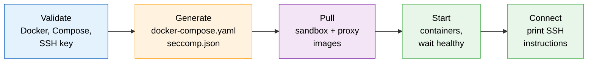

# Registry Publishing & Distribution

Images are built locally by default. For teams sharing pre-built images via an on-prem registry (Nexus, Artifactory, Harbor), use the publish and start scripts.

## Build and Push Images

```bash
# Publish base images + selected extensions to your registry
REGISTRY=nexus.internal.example.com/safe-ai ./scripts/publish.sh

# Only build specific extensions (dependencies resolved automatically)
REGISTRY=nexus.internal.example.com/safe-ai ./scripts/publish.sh --images node,codex,java

# Tag a release
REGISTRY=nexus.internal.example.com/safe-ai ./scripts/publish.sh --version v1.0.0

# Include a team-specific custom Dockerfile
REGISTRY=nexus.internal.example.com/safe-ai ./scripts/publish.sh \
  --images claude \
  --custom examples/claude-java.Dockerfile:claude-java
```

The publish script bakes the curated `allowlist.yaml` into the proxy image. Developers who pull the image cannot accidentally override the allowlist — they would need to rebuild the proxy image or edit the compose file (a deliberate choice, not a mistake).

See `.github/workflows/publish.yaml` for a GitHub Actions workflow you can adapt.

## Security Model for Registry Deployments

Security controls are split between two layers:

| Control | Where it lives | Central update mechanism |
|---------|---------------|--------------------------|
| Domain allowlist | Baked into proxy image | Push new proxy image |
| Seccomp profile | Embedded in aibox.sh | Redistribute aibox.sh |
| Capabilities, read-only root, network isolation | Embedded in aibox.sh | Redistribute aibox.sh |

This split is deliberate: even if the registry is compromised, an attacker cannot weaken the seccomp filter, capability drops, or network isolation because those are enforced by the compose file in aibox.sh, not by the images.

---

## Distributing aibox to Developers

`aibox` (the `scripts/aibox.sh` script) is a self-contained startup script that pulls pre-built images from your registry and generates all required configuration at runtime. Developers do not need to clone the repository — they only need the script and a registry URL.



### How It Works

`aibox` is a single shell script that:

1. Validates prerequisites (Docker, Docker Compose, SSH key)
2. Generates `docker-compose.yaml` and `seccomp.json` in `~/.safe-ai/`
3. Pulls sandbox and proxy images from your registry
4. Starts containers and waits for healthy status
5. Prints SSH connection instructions

Because all configuration is generated at runtime, developers only need the script itself and a `REGISTRY` URL.

### Developer: One Command to Start

```bash
# Start with base sandbox
REGISTRY=nexus.internal.example.com/safe-ai ./aibox.sh

# Start with Java sandbox
REGISTRY=nexus.internal.example.com/safe-ai IMAGE=java ./aibox.sh

# Start with a specific version
REGISTRY=nexus.internal.example.com/safe-ai IMAGE=claude VERSION=v1.0.0 ./aibox.sh
```

The script checks prerequisites (Docker, Docker Compose, SSH key), pulls images, starts containers, and prints the SSH command. Configuration is stored in `~/.safe-ai/`.

| Variable | Default | Description |
|----------|---------|-------------|
| `REGISTRY` | (required) | Registry URL prefix |
| `IMAGE` | `sandbox` | Sandbox image name (`sandbox`, `node`, `java`, `python`, `claude`, `codex`, `codex-java`) |
| `VERSION` | `latest` | Image tag |
| `SSH_PORT` | `2222` | Host port for SSH |
| `SSH_KEY` | `~/.ssh/id_ed25519.pub` | Path to SSH public key |

## Distribution via Local Registry

Host `aibox` as a raw file on the same registry that serves your container images. Developers download it once with `curl`.

### Registry Setup

Upload `aibox` to a raw/generic file repository on your registry. Most registries support hosting arbitrary files:

| Registry | Repository Type | Upload Command |
|----------|----------------|----------------|
| Nexus | Raw (hosted) | Upload via UI or `curl --upload-file` |
| Artifactory | Generic | `jfrog rt upload scripts/aibox.sh safe-ai/aibox` |
| Harbor | N/A | Use an HTTP server or S3 bucket alongside Harbor |
| HTTP server | Static files | `cp scripts/aibox.sh /var/www/safe-ai/aibox` |

**Recommended URL pattern:**

```
https://registry.corp.com/safe-ai/aibox
https://registry.corp.com/safe-ai/aibox.sha256
```

### Generating the Checksum

When uploading a new version, always publish a SHA256 checksum alongside the script:

```bash
sha256sum scripts/aibox.sh > aibox.sha256
# Upload both aibox and aibox.sha256 to your registry
```

### Developer Install

```bash
# Download
curl -L https://registry.corp.com/safe-ai/aibox -o ~/bin/aibox
chmod +x ~/bin/aibox

# Verify integrity (optional but recommended)
curl -L https://registry.corp.com/safe-ai/aibox.sha256 -o /tmp/aibox.sha256
echo "$(cat /tmp/aibox.sha256 | awk '{print $1}')  $HOME/bin/aibox" | sha256sum --check

# Run
REGISTRY=registry.corp.com/safe-ai aibox
```

Ensure `~/bin` is in the developer's `PATH` (most Linux/macOS systems include it by default).

### Developer Update

Developers re-run the same `curl` command to get the latest version:

```bash
curl -L https://registry.corp.com/safe-ai/aibox -o ~/bin/aibox
```

## Always-Latest Strategy

The recommended approach is to keep developers on the latest version at all times:

1. **Script**: The org uploads the latest `aibox` to a stable URL. Developers re-curl to update.
2. **Images**: `aibox` pulls `:latest` by default. The org controls what `:latest` points to by pushing new images to the registry.
3. **No version pinning needed**: Since the org controls both the script URL and the registry's `:latest` tag, they are always in sync.

### Keeping Script and Images in Sync

When releasing a new version:

```bash
# 1. Build and push new images
REGISTRY=registry.corp.com/safe-ai VERSION=latest ./scripts/publish.sh

# 2. Upload updated aibox to the same registry
# (copy scripts/aibox.sh to your raw file repository as "aibox")
```

Both the script and images should be updated together. Since `aibox` generates `docker-compose.yaml` at runtime, the generated configuration always matches the script version.

### Optional: Self-Update Check

For teams that want developers to be reminded to update, the script could be modified to check its own version:

```bash
# At the top of aibox, add:
SCRIPT_VERSION="2026.03.08"
LATEST=$(curl -sf https://registry.corp.com/safe-ai/aibox.version || echo "")
if [ -n "$LATEST" ] && [ "$LATEST" != "$SCRIPT_VERSION" ]; then
    warn "A newer version of aibox is available. Run:"
    echo "  curl -L https://registry.corp.com/safe-ai/aibox -o ~/bin/aibox"
fi
```

This is optional — the simplest approach is to let developers re-curl when instructed.

## What the Organization Needs

| Responsibility | Details |
|---------------|---------|
| **Host the script** | Upload `aibox` to a raw file repository on your registry |
| **Host images** | Push sandbox and proxy images with `scripts/publish.sh` |
| **Publish checksum** | Upload `aibox.sha256` alongside the script |
| **Communicate updates** | Notify developers when a new version is available (email, Slack, etc.) |
| **Keep in sync** | Update `aibox` and images together on each release |

## What Developers Need

| Requirement | Details |
|-------------|---------|
| **Docker + Docker Compose v2** | Installed and running |
| **SSH key** | Ed25519 recommended (`ssh-keygen -t ed25519`) |
| **curl** | To download `aibox` |
| **REGISTRY URL** | Provided by the organization |

## CI/CD Integration

The existing publish workflow (`.github/workflows/publish.yaml`) builds and pushes container images. To automate script distribution, add a step to upload `aibox` to your registry after images are pushed:

```yaml
# Example addition to publish workflow
- name: Upload aibox script
  run: |
    curl --upload-file scripts/aibox.sh \
      https://registry.corp.com/repository/safe-ai-raw/aibox
    sha256sum scripts/aibox.sh | \
      curl --upload-file - \
      https://registry.corp.com/repository/safe-ai-raw/aibox.sha256
```

Adapt the upload command for your specific registry type and authentication.

## See Also

- [Managed Deployment](managed-deployment.md) -- centralized deployment where developers only SSH in
